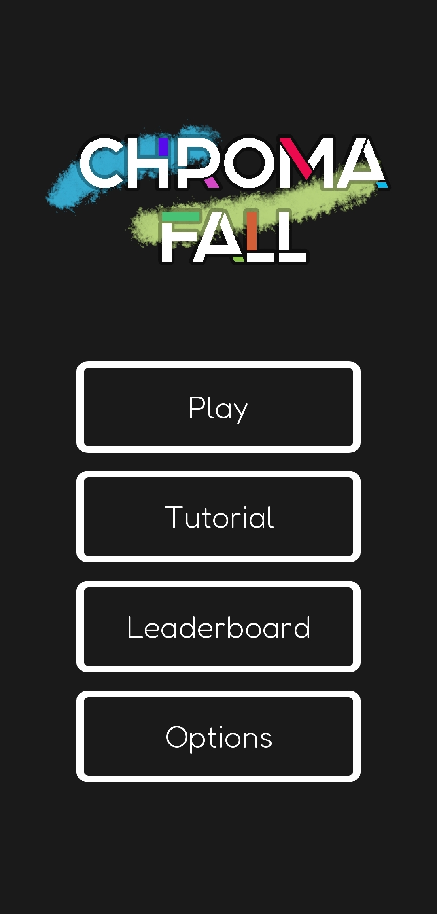
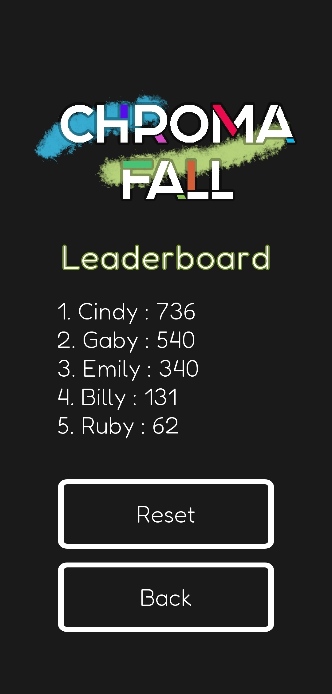
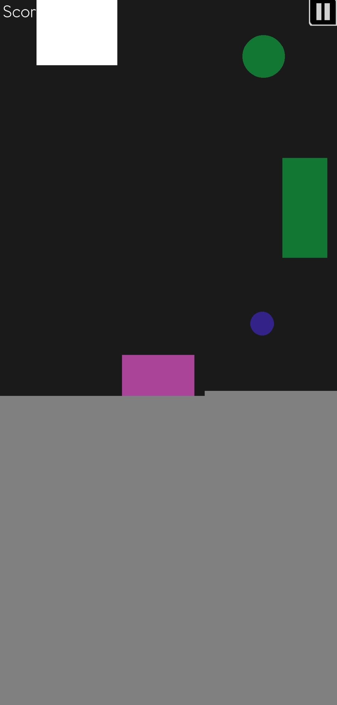

  

  A fast-paced color-matching arcade game built with <b>LibGDX</b>.

---

## 🎮 Overview

**Chroma Fall** is a minimalist arcade game that tests your reflexes and sense of timing. \
Your goal: **match the color of the falling blocks** before they hit the wrong surface — or else is game over.

  

You control a colorful ball plummeting through an infinite pit filled with colored obstacles — tilt your phone or tablet to dodge them and collect glowing orbs to change your color. Matching your color to the obstacles lets you pass safely through them! 

Built using **LibGDX** and optimized for **Android**.

---

## 🧩 Features

- 🎨 **Dynamic color-based gameplay** — dodge obstacles and collect orbs to change your color and survive longer.  
- ⚡ **Smooth tilt controls** — intuitive motion-driven gameplay optimized for mobile devices.  
- 🧠 **Custom local leaderboard** — track your highest scores and challenge yourself to beat your personal best.  
- 🎵 **Funky, royalty-free soundtrack** — an energetic background beat that keeps the pace engaging.  
- 🖌️ **Minimalist UI** — clean and modern interface designed for clarity and style.  
- 👁️ **Color-blind friendly mode** — adjustable color palette options for accessible gameplay.  
- 💾 **Offline play** — no internet connection required to enjoy the game.  
- 🔧 **Open-source structure** — built with LibGDX and Gradle, easy to explore and modify.

  <table>
    <tr>
      <td align="center">
         
        <b>Main Menu</b>
      </td>
      <td align="center">
         
        <b>Leaderboard</b>
      </td>
      <td align="center">
         
        <b>Color-Blind Mode</b>
      </td>
    </tr>
  </table>

--- 
## 🛠️ Requirements

Before running the game or building from source, ensure you have:

| Tool | Version | Description |
|------|----------|-------------|
| **Java JDK** | 8+ | Required to compile the project |
| **Gradle** | 7.x | Build automation tool |
| **Android SDK** | 30+ | To build and deploy to Android |
| **LibGDX** | 1.12+ | Core game framework |
---
### 📝 Licenses

**Code License**  
This project is licensed under the **MIT License** — you’re free to use, modify, and distribute the code, provided that you include the original copyright notice.  
See the [LICENSE](LICENSE) file for full details.

**Assets and Media**  
- 🎵 The soundtrack and sound effects are **royalty-free** and used under a free-to-use license.  
- 🎨 Visual assets (logo, UI elements, textures and icons) were either self-created or obtained from free-to-use resources.  

